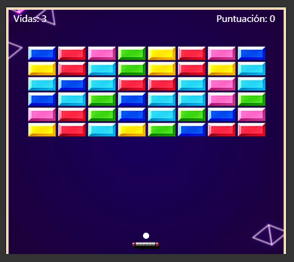

# Arkanoid Juego Clasico en JavaScript con Canvas

## Screenshot

## Live Preview
[ARKANOID](https://arkanoid-gustavo-sds.netlify.app/)

## Description

This is a classic Arkanoid game that can be played in any web browser that supports Canvas.
You can control it with the keyboard direction keys.

You can play until 3 lives and earn points every time you destroy a block.
The score is displayed at the top of the screen.

## Technologies

- HTML
- CSS
- JavaScript